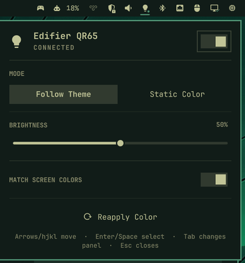

# Edifier QR65 for Omarchy

An unofficial Omarchy QML plugin for viewing and controlling Edifier QR65
ambient lighting from the shell bar.

> [!IMPORTANT]
> This repository is only the Omarchy frontend. It contains no QR65 daemon,
> backend, service definition, theme hook, or service installer. It consumes the
> separately installed and managed
> [`LightQv/edifier-qr65`](https://github.com/LightQv/edifier-qr65) **Consumer API
> v1** and does not own that daemon's installation, updates, startup, or removal.

## Preview



## Requirements

- Omarchy with shell plugin support
- Edifier QR65 daemon release **v0.1.1** at reviewed commit
  `ef4d923106adcf9cbb80a087b306c9eb16fdf1fd`, with its launcher at
  `~/.local/bin/edifier-qr65`
- Consumer API version **1** and status schema version **1**

API/status version 1 is the minimum supported contract. The current plugin
accepts version 1 explicitly and disables controls when metadata or status is
missing, malformed, stale, or incompatible.

## Install

Install the two projects in this order:

1. Install the reviewed daemon release. Its documentation is authoritative for
   daemon requirements and setup:

   ```bash
   git clone https://github.com/LightQv/edifier-qr65.git
   cd edifier-qr65
   git checkout --detach ef4d923106adcf9cbb80a087b306c9eb16fdf1fd
   ./install.sh
   ```
2. Add this QML plugin:

   ```bash
   omarchy plugin add https://github.com/LightQv/omarchy-edifier-qr65.git --enable
   ```

No second installer step is required or provided by this repository.

## Using the panel

Click the QR65 glow icon in the bar to open the panel. It provides:

- **Follow Theme** and **Static Color** modes
- Eight color presets and validated `#RRGGBB` input
- A brightness slider, available while the daemon reports the speaker connected
- Optional screen-color matching through the daemon
- **Reapply Color** for the current desired mode and color
- A handoff switch that asks the daemon to release BLE to Edifier ConneX or
  resume QR65 control
- Connection status and concise recovery guidance

The panel supports the mouse, arrow keys or `h/j/k/l`, Enter or Space to select,
`/` to focus the hexadecimal editor in Static Color mode, Escape to close, and
Tab or Shift+Tab to move between neighboring bar panels.

### Theme following

In Follow Theme mode, the plugin reacts directly to the shell's `Color.accent`,
validates it, and sends the daemon an explicit `#RRGGBB` dynamic color through
Consumer API v1. It repeats this whenever the reactive accent changes and when
the color is reapplied.

There is **no Omarchy theme hook**: the plugin neither installs nor needs one.
Theme resolution belongs to this QML frontend; BLE access and hardware state
remain the external daemon's responsibility.

The profile accepts any theme accent, not just the themes used during calibration.
If Follow Theme does nothing, inspect the live frontend separately from the daemon:

```bash
omarchy-shell lightqv.edifier-qr65 status
edifier-qr65 status --json
```

Frontend diagnostics include `themeAccent`, `themeAccentValid`, API readiness,
active command, pending mode, and queued action. Invalid accents now produce panel
feedback. After updating plugin code, try `omarchy-shell shell rescanPlugins`;
if the old code remains loaded or the diagnostic target is missing, use
`omarchy restart shell`. This restarts the desktop shell, not the QR65 daemon.

The following IPC helpers invoke the same service methods as the panel:

```bash
omarchy-shell lightqv.edifier-qr65 followTheme
omarchy-shell lightqv.edifier-qr65 staticColor '#FFFFFF'
```

## QR65 activation constraint

After a cold speaker start, the tested QR65 exposes its control connection when
Bluetooth input has an active Bluetooth Classic connection. When the panel
reports **Activation required**:

1. Switch the speaker to Bluetooth input.
2. Connect any previously paired Bluetooth audio host, such as this computer or
   a phone. It does not need to be Linux's default output, and ConneX is not
   required.
3. Wait for the daemon to connect, then switch back to wired input if desired.

If the speaker remains on Bluetooth input, the operating system may reconnect
its audio endpoint automatically after power cycles and boots. Pairing, audio
connection, codec selection, and output routing are outside this plugin and the
BLE daemon.

A warm speaker sometimes permits BLE reconnection without Classic audio, but
that is not a reliable cold-start procedure. A cold start on RCA exposed no
tested control path to Linux or ConneX.

ConneX and the daemon cannot hold the QR65 BLE control connection at the same
time. Use the panel's handoff switch before opening ConneX, close ConneX before
resuming, and repeat the activation flow after a power cycle or lost connection
when requested. Releasing is temporary: because the daemon service remains
enabled, it starts again after the next login/reboot. Lighting controls remain
disabled while released so the panel cannot imply that ConneX-owned changes were
applied by the daemon.

The plugin does not invoke `systemctl` directly. Its `release` and `resume`
actions ask the external daemon CLI to stop or start only its own
`edifier-qr65.service` systemd **user** service. They do not affect a system
service and require no root privileges.

While connected, the bar-icon tooltip reports the requested display color and
device-confirmed command as `HEX: #RRGGBB -> #RRGGBB`. Equal values indicate
literal matching; different values expose the active calibration transform.

## Missing or incompatible daemon

The plugin checks Consumer API metadata before requesting status or enabling
controls. If the daemon executable is absent, unavailable, returns an
unsupported contract, or reports invalid/stale status, the widget is dimmed,
the panel shows the bounded error, and control actions remain disabled. Install
or update the external daemon independently; reinstalling this plugin does not
provide or repair it.

## Optional shortcut

The bar icon works without a key binding. To also toggle the panel with
`SUPER+CTRL+G`, add this line to `~/.config/hypr/bindings.lua`:

```lua
o.bind("SUPER + CTRL + G", "QR65 glow", "omarchy-shell shell toggle lightqv.edifier-qr65")
```

Remove that line manually if you no longer want the shortcut; plugin management
does not edit Hyprland configuration.

## Update and removal

Update the QML plugin independently:

```bash
omarchy plugin update lightqv.edifier-qr65
```

Update the daemon separately by following the daemon project's installer and
upgrade instructions. A plugin update never updates or restarts the daemon.

Remove only the plugin with:

```bash
omarchy plugin remove lightqv.edifier-qr65
```

This leaves the external daemon, its service, configuration, and state intact.
If those are no longer wanted, remove them separately using the daemon
project's instructions. Also remove the optional shortcut manually.

## Development

Validate a checkout against Omarchy's official plugin rules:

```bash
omarchy plugin validate .
scripts/check-release-metadata.sh
scripts/lint-qml.sh
node --test service.test.cjs
```

CI runs the same checks against a pinned current Omarchy revision.

## Marketplace safety boundary

Marketplace installation clones this repository's complete tracked tree,
including documentation, tests, CI metadata, and inert development scripts;
Omarchy loads only the QML entry points declared in `manifest.json`. The tree
contains no privileged setup, daemon/backend payload, runtime executable,
service unit, lifecycle installer, theme hook, auto-discovered agent
instructions, raw BLE access, firmware operation, or arbitrary protocol
control.

When enabled, the service automatically invokes the fixed
`~/.local/bin/edifier-qr65` launcher at startup and every eight seconds. It uses
fixed argument arrays, a minimal environment, an external TERM-to-KILL deadline,
bounded output collection, and a second QML watchdog. Returned JSON is strictly
validated, unsupported versions are rejected, and stale connected status is
treated as unavailable. Release and resume are the user-service operations
described above. Device access, command enforcement, persistence, installation,
updates, and removal remain under the separately managed daemon's boundary.

Removing this plugin intentionally leaves the daemon, its user service,
configuration, and state in place. The standard marketplace install therefore
requires the manual daemon setup documented above.

## License

Licensed under the [MIT License](LICENSE).
